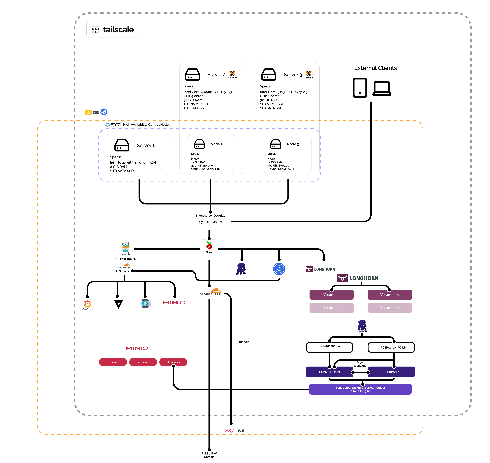

# 🏡 Homelab Infrastructure Overview

  

## 📖 Summary

This repository documents my personal **homelab Kubernetes infrastructure**, designed to replicate a production-grade, high-availability DevOps environment.  
The setup demonstrates proficiency in container orchestration, storage management, networking, observability, and secure service exposure using modern open-source tools.

---

## 🧩 Core Components

### ⚙️ Kubernetes Cluster

- **Distribution:** K3s (lightweight Kubernetes)
- **Topology:** 3 master nodes with embedded etcd + possibility for worker nodes
- **Control Plane:** Nodes 1-3
- **Networking:**
  - Internal connectivity via **Tailscale mesh VPN**
  - Nodes and workloads isolated from the public internet
  - Ethernet connection on 2.5 GbE managed switch

### 🧠 Control & Networking

- **Tailscale** handles private networking, node discovery, and external access to the cluster.
- **Traefik (HA pair)** serves as the ingress controller and reverse proxy.
- **Cert-Manager** automatically issues and renews TLS certificates for all internal and external services.

---

## 🗄️ Storage & Data Management

- **Longhorn** provides distributed, replicated block storage across all nodes.
- **MinIO** runs in tenant mode as an S3-compatible object store.
- **CloudNativePG** (CNPG) manages PostgreSQL clusters with:
  - High-availability replication
  - Scheduled S3 backups to MinIO using Barman
  - Async replication between clusters for fault tolerance
  - Master node orchestration

---

## 🔍 Observability Stack

- **Prometheus Operator** for metrics collection
- **Grafana** for dashboards and visualizations
- **Alertmanager** for notifications
- **Loki** (planned integration) for centralized log aggregation

---

## 🔐 Security

- All cluster communication runs within **Tailscale's** tailnet.
- No public Kubernetes API exposure.
- SSL/TLS certificates managed via **cert-manager** as certificate store and **Let's encrypt** as certificate issuer.
- Secrets managed externally **(Hashicorp Vault)** — none stored in plaintext within the repo.

---

## 🧰 Supporting Services

- **Hashicorp Vault** for dynamic secrets and credentials
- **Pi-hole** for DNS resolution, ad-blocking, and also DoH integration.
- **Cloudflare Tunnels** optionally expose selected services (n8n) securely via HTTPS

---

## 🧮 Infrastructure Summary

| Layer        | Tool / Service           | Purpose                         |
| ------------ | ------------------------ | ------------------------------- |
| Networking   | **Tailscale**            | Secure mesh connectivity        |
| Ingress      | **Traefik**              | Reverse proxy + SSL termination |
| Storage      | **Longhorn**             | Distributed volume management   |
| Object Store | **MinIO**                | S3-compatible storage           |
| Database     | **CloudNativePG**        | Postgres HA and backups         |
| Monitoring   | **Prometheus / Grafana** | Metrics and dashboards          |
| Automation   | **n8n**                  | Event-based workflows           |
| Secrets      | **Vault**                | Encrypted secret management     |

---

## 🚀 Key Capabilities

- Fully declarative **GitOps-ready** environment (ArgoCD / Flux-compatible)
- High-availability Postgres with **multi-cluster failover**
- Encrypted, self-healing **persistent storage**
- Secure, DNS-based service exposure via **Tailscale** and **Cloudflare Tunnels**
- Modular design — supports scaling nodes or services independently

---

## 📄 Repository Contents

Each file path contains the necessary documentation on the manifests used, as well as how the service plays in relation to other services.

| Path             | Description                                                                                                                                                                          |
| ---------------- | ------------------------------------------------------------------------------------------------------------------------------------------------------------------------------------ |
| `./Homelab.png`  | Main architecture diagram                                                                                                                                                            |
| `cert-manager/`  | YAML files for the cert-manager setup                                                                                                                                                |
| `cloudflare/`    | Declaration files to initiate Cloudflare Tunnels service                                                                                                                             |
| `cloudnativepg/` | Files necesary to set up the CloudNative operator, as well as monitoring rules, and the cluster itself. Finally including files to set up the Barman Cloud Plugin to create backups. |
| `hashicorp/`     | Files for any Hashicorp service included, such as Vault                                                                                                                              |
| `keycloak/`      | Files to set up a fully functional Keycloak set up, with dynamic secret provisioning from Vault                                                                                      |
| `longhorn/`      | Files needed to set up the longhorn storage manager                                                                                                                                  |
| `pihole/`        | Files to set up pihole in HA mode, as well as monitoring                                                                                                                             |
| `tailscale/`     | Tailscale ingress and egress files, which allow interaction from the cluster with the tailnet                                                                                        |
| `traefik/`       | Main ingress and Load Balancer service                                                                                                                                               |

---

## 🧑‍💻 Author

**Juan Campos**  
DevOps & Systems Designer — Building resilient, self-hosted cloud infrastructure for learning, experimentation, and production-ready prototypes. Industrial Designer turned homelab nerd turned DevOps engineer.

[LinkedIn](https://www.linkedin.com/in/juan-ignacio-campos-ruiz-3692212b2/)

---

> **Note:** All sensitive data (tokens, passwords, private keys) are encrypted or managed externally.  
> The domains and endpoints shown here are non-public and accessible only via VPN.

---
