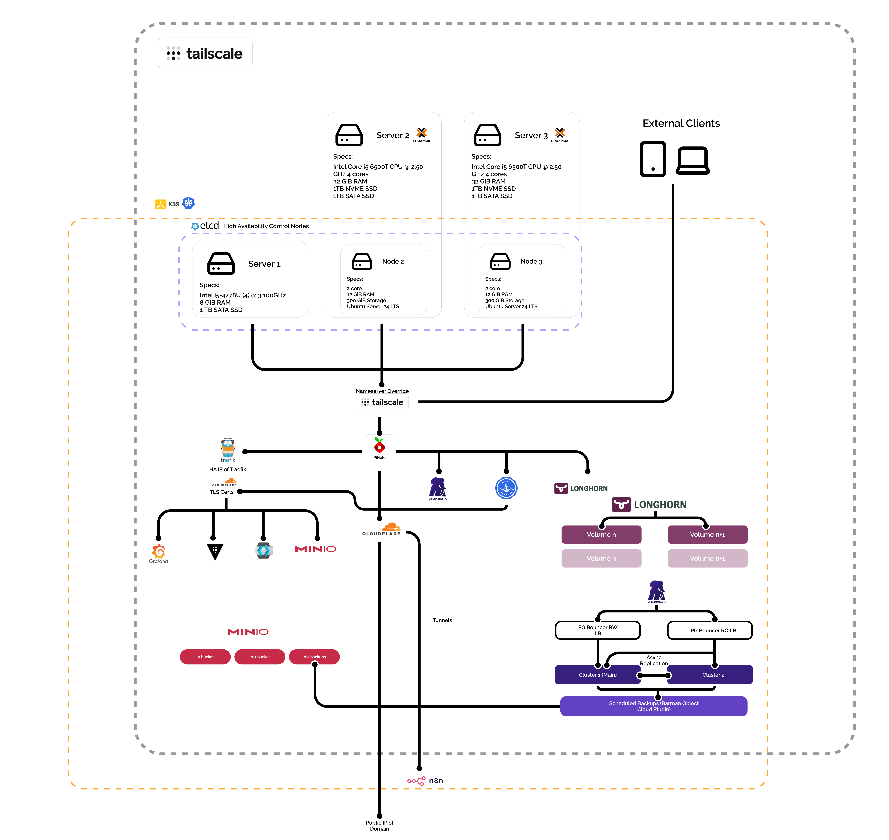

# 🏡 Cloudnative PG Overview

  

## 📄 Contents

Each file path contains the necessary documentation on the manifests used, as well as how the service plays in relation to other services.

| Path                 | Description                              |
| -------------------- | ---------------------------------------- |
| `./CloudNative.png`  | Main architecture diagram                |
| `barmancloudplugin/` | Files needed for the CloudPlugin to work |

---

## 🧑‍💻 Author

**Juan Campos**  
DevOps & Systems Designer — Building resilient, self-hosted cloud infrastructure for learning, experimentation, and production-ready prototypes. Industrial Designer turned homelab nerd turned DevOps engineer.

[LinkedIn](https://www.linkedin.com/in/juan-ignacio-campos-ruiz-3692212b2/)

---

> **Note:** All sensitive data (tokens, passwords, private keys) are encrypted or managed externally.  
> The domains and endpoints shown here are non-public and accessible only via VPN.

---
