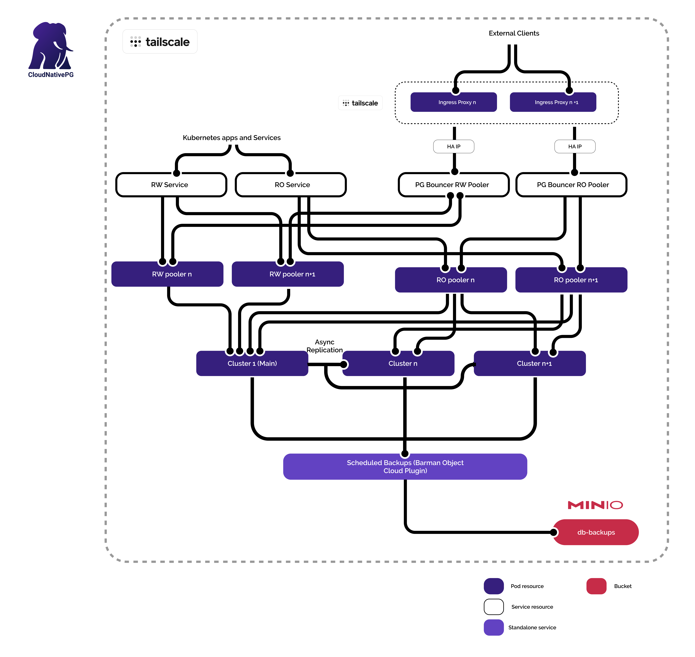

# 🏡 Cloudnative PG Overview

<p align="center">
  
</p>

## 📄 Networking

As was the philosophy of this homelab the paramount priorities were data integrity, security and High Availability. Data integrity was pretty easy to solve using CloudNative PG, as async replication and data backups were easy to implement, this, paired with Longhorns volume replication provided with a very robust data backup and integrity solution. Security was provided by the use of a VPN, and also Bouncer resources which are standard in CLoudNative PG. The last and perhaps the most difficult hurdle to overcome was High Availability. Cloudnative offers good tools in the pursuit for HA, such as master node orchestration and replication, it does not however offer a good solution on Load Balancer HA.

> 💡 **Use Case Scenario**
>
> Say I set up my DB cluster with the default LB set up — the LB will listen at all the IPs of my current nodes, say for instance:
>
> ```
> 10.10.10.1  →  Node 1
> 10.10.10.2  →  Node 2
> 10.10.10.3  →  Node 3
> ```
>
> Now, for instance say I want to access my PG database through `10.10.10.1` which may correspond to Node 1, and all is fine while that Node is available — which of course it may or may not at any given moment.  
> In such case I could access another IP, but I would manually have to input said IP.
>
> Here is where **Tailscale** and a new Alpha service called **Tailscale Services** shines through.  
> Tailscale Services works in conjunction with **Proxy Groups** to assign IPs to services inside the Kubernetes cluster, without the need of having to create new proxies for each service I may want to expose to the tailnet, in addition to giving me a highly available set of pods which manages the resolution of said provisioned IPs.
>
> What does this mean? This means that I will now only have **ONE IP** for my entire Read Write Load Balancer and one for my RO Load Balancer — say `10.10.10.4` and `10.10.10.5`.  
> These will not change as long as my Kubernetes control plane is up, thus providing a satisfactory solution for HA as shown in the following image.
>
> <p align="center">
>   </p>

## 📄 Backups

Backups are entirely handled by **CloudNativePG’s Barman Cloud Plugin**.  
As stated in their documentation, it uses the `barman-cloud` tool from the Barman project to generate and store backups in supported Object Storage providers.

As part of the self-hosted philosophy of this homelab, I wanted to host my own S3-compatible service instead of relying on external storage. This led me to **MinIO**, which I already had experience with from previous jobs.

The plugin manifests live in the [`./barmancloudplugin`](./barmancloudplugin) folder and consist of the following files:

| File                                                       | Description                                                                              |
| ---------------------------------------------------------- | ---------------------------------------------------------------------------------------- |
| [`deployment.yaml`](./barmancloudplugin/deployment.yaml)   | Deploys the Cloud Plugin itself. This file is unchanged from the official documentation. |
| [`objectStore.yaml`](./barmancloudplugin/objectStore.yaml) | Defines the connection details to the S3 endpoint and the necessary access keys.         |
| [`backup.yaml`](./barmancloudplugin/backup.yaml)           | Initiates backups for the cluster according to the defined schedule.                     |

Additionally, a small change was made to [`./cluster/cluster.yaml`](./cluster/cluster.yaml) to **enable the Barman plugin** in the `plugins` section.

## 📈 Monitoring

Monitoring is handled through an implemented **PodMonitor** solution.  
The **Prometheus Operator** automatically discovers this PodMonitor, enabling seamless metrics collection from the PostgreSQL cluster.

Using the official 📊 [CloudNativePG Grafana Dashboard](https://grafana.com/grafana/dashboards/20417-cloudnativepg/), visualization and monitoring are straightforward, providing clear insights into cluster health, replication status, and performance.

⚠️ Custom alert rules were also implemented, as seen in [prometheusrule.yaml](./prometheus/prometheusrule.yaml), leveraging the **PrometheusRule** CRD exposed by the Prometheus Operator.

🔗 More information about the monitoring setup in this homelab can be found at [Monitoring with the Kube-Prometheus-Stack](../kube-prometheus/README.md).

## 📄 Contents

Each file path contains the necessary documentation on the manifests used, as well as how the service plays in relation to other services.

| Path                 | Description                              |
| -------------------- | ---------------------------------------- |
| `./CloudNative.png`  | Main architecture diagram                |
| `barmancloudplugin/` | Files needed for the CloudPlugin to work |
| `cluster/`           | Cluster manifests for CloudNativePG      |
| `operator/`          | Operator configuration and CRDs          |
| `prometheus/`        | Metrics and ServiceMonitor definitions   |
| `README.md`          | This documentation file                  |
| `Homelab.png`        | Optional overall homelab diagram         |

---

## 🧑‍💻 Author

**Juan Campos**  
DevOps & Systems Designer — Building resilient, self-hosted cloud infrastructure for learning, experimentation, and production-ready prototypes. Industrial Designer turned homelab nerd turned DevOps engineer.

[LinkedIn](https://www.linkedin.com/in/juan-ignacio-campos-ruiz-3692212b2/)

---

> **Note:** All sensitive data (tokens, passwords, private keys) are encrypted or managed externally.  
> The domains and endpoints shown here are non-public and accessible only via VPN.

---
